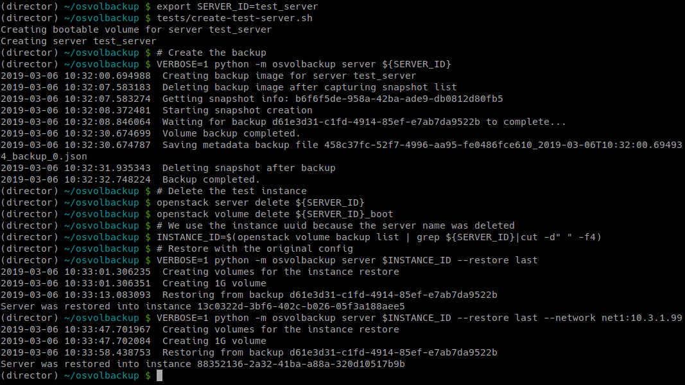

OpenStack Server Volumes Backup and Restore Tool
================================================

This command line utility can be used to backup/restore OpenStack volume backed server instances using Cinder backup service.

Screenshot
----------

Features
--------

* Live instance backup

  * See ``consistency restrictions`` below
  * Embed essential metadata in backup description
  * Export backup volume metadata to file

Requirements
------------

* Python2.7+ and the OpenStack API libraries
* OpenStack environment with volume backed server instances
* OS environment variables set for the admin project ``(source stackrc)``
* `Cinder backup service <https://docs.openstack.org/cinder/queens/configuration/block-storage/backup-drivers.html>`_ properly configured
* Tested on [RedHat Open Stack Platform 13], should work on other OpenStack Queens based distributions

:warning: Live Backup Consistency Restrictions :warning:
--------------------------------------------------------

Live backup consistency of openstack images is dependent in the following conditions:

#. When using kvm/libvirt, guests must have the `Qemu guest agent <https://wiki.libvirt.org/page/Qemu_guest_agent>`_ installed, backups will succeed if the agent is not available, consistency will depend in the guest IO activity during the snapshot»
#. Nova API create image function does `not wait for snapshot creation <https://github.com/openstack/nova/blob/master/nova/compute/api.py#L3094>`_ before unfreezing the I/O, consistency will depend on the block device driver snapshot technology, it may depend on the guest IO activity during the snapshot creation

How to install
--------------

.. code-block:: sh

   pip install --user osvolbackup

How to run from source
----------------------

.. code-block:: sh

   git clone https://github.com/CCSGroupInternational/osvolbackup.git
   cd osvolbackup.git
   pip install --user -rrequirements.txt
   python -m osvolbackup server «server_name»

How to test:
------------

.. code-block:: sh

   # Create a test server
   export SERVER_ID=test_server
   tests/create-test-server.sh

   # Create the backup
   VERBOSE=1 python -m osvolbackup server ${SERVER_ID}

   # Delete the test instance
   openstack server delete ${SERVER_ID}
   openstack volume delete ${SERVER_ID}_boot

   # We use the instance uuid because the server name was deleted
   INSTANCE_ID=$(openstack volume backup list | grep ${SERVER_ID}|cut -d" " -f4)
   # Restore with the original config
   VERBOSE=1 python -m osvolbackup server $INSTANCE_ID --restore last
   # Restore with a different network config
   VERBOSE=1 python -m osvolbackup server $INSTANCE_ID --restore last --network net1:10.3.1.99

Copyright
---------

© 2019 CCS Group International, distributed under the `Apache-2 license <LICENSE>`_.
